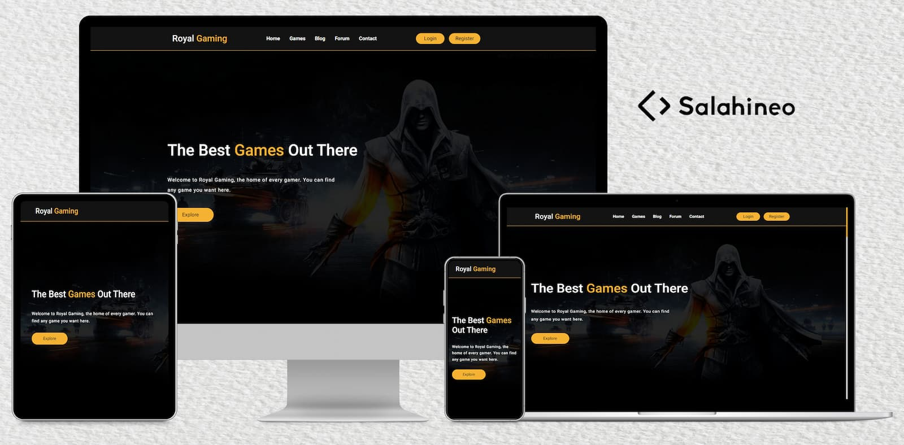

<h1 align="center">Royal Gaming</h1>

## Table of Contents

- [Goal](#goal)
- [Benefits](#benefits)
- [Demo](#demo)
- [Technologies](#technologies)
- [Contact](#contact)
- [Copyright and license](#copyright-and-license)

### Goal

This is a gaming reviews website. I coded this project to practice on my knowledge of HTML, CSS, JavaScript, jQuery, and Bootstrap in real project.

### Benefits

Here are some ideas to benefit from this project:

- Take this project as a task and try to make it, and if you could not do a specific section, see how i make it in the source code (use comments to reach this section).
- Extract code of specific section and use it in your project.
- Review source code to see how other people code their projects.
- Edit on this project after studying its code well, to know how to work in pair-programming with other people.
- Upgrade this project, and add your own sections or pages.

### Demo

Here is the demo of this [project](https://salahineo.github.io/Royal-Gaming/)

### Technologies

- HTML
- CSS
- JavaScript
- jQuery
- Bootstrap

> This project is fully responsive

### Contact

- [Github](https://github.com/salahineo) :octocat:
- [LinkedIn](https://linkedin.com/in/salahineo) 💼
- [Website](https://salahineo.github.io/salahineo/) :globe_with_meridians:
- [Facebook](https://facebook.com/salahineo) 😎
- [Twitter](https://twitter.com/salahineo) 🐤
- <a href="mailto:salahineo.work@gmail.com">Email</a> :email:

### Copyright and license

- **[GPLv3](https://www.gnu.org/licenses/gpl-3.0)**
- **© 2020 | Mohamed Salah**

---

**If You Find My Work Good, Consider Giving it a :star: or Fork-ing to Show Some :heart:. It Helps Me Stay on Track and Be Motivated.**

> **Explore all of my projects from [Here](https://github.com/salahineo/Projects-Reference)**

---
